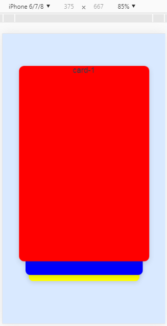
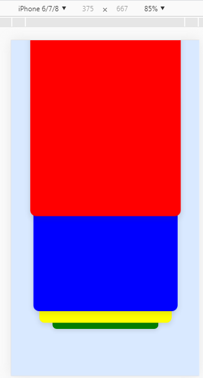
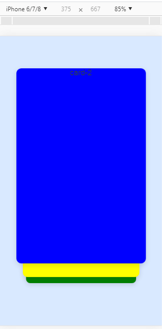

# vue-slide-card
Vue 层叠卡片滑动切换、卡牌动态滑动切换效果
## 效果展示
* <figure class="third">
      
  </figure>
* [线上 demo 演示](http://www.yunfengzhijia.cn/)  
## 实现步骤
### 给最外层容器固定高度（视口高度），绑定三个滑动事件
hmtl：
```html
<template>
  <div
    @touchstart="playerTouchStart"
    @touchmove="playerTouchMove"
    @touchend="playerTouchEnd"
    @mousedown="playerTouchStart"
    @mousemove="playerTouchMove"
    @mouseup="playerTouchEnd"
    class="container">
```
css：
```css
.container {
  height: 100vh;
  position: relative;
  overflow: hidden;
  padding-top: 74px;
}
```
### 通过记录开始触摸位置，滑动时判断滑动方向，比较麻烦的是，滑动时需要动态去计算当前变化的每一个卡片的位置，然后滑动结束时，使用 `transition` 来使卡片正确归位。
js：
```js
methods: {
    // 滑动开始
    playerTouchStart (ev) {
      ev = ev || event
      this.isClick = true
      // tounches类数组，等于1时表示此时有只有一只手指在触摸屏幕
      if (ev.touches.length === 1) {
        // 记录开始位置
        this.startY = ev.touches[0].clientY
        console.log('开始触摸-startY', this.startY)
      }
    },
    // 滑动中
    playerTouchMove (ev) {
      ev = ev || event
      this.isClick = false
      if (ev.touches.length === 1) {
        // 滑动时距离浏览器左侧实时距离
        this.moveY = ev.touches[0].clientY
        // 起始位置减去实时的滑动的距离,得到手指实时偏移距离
        this.disY = this.startY - this.moveY
        console.log('滑动-disY', this.disY)
        // 判断滑动方向
        if (this.disY < 0) {
        // 向下滑
          this.slideDirection = 0
          // 当前上一个变化
          if (this.cardArrs[this.currentIndex - 1]) {
            let item_0 = this.cardArrs[this.currentIndex - 1]
            item_0.translateY = -window.innerHeight - this.disY + 'px'
            item_0.transitionTime = 0
            if (-this.disY <= this.slideFilishDistance) {
              item_0.scale = -(0.2 / this.slideFilishDistance) * this.disY + 0.8
            }
          }
          // 当前第一个变化
          let item_1 = this.cardArrs[this.currentIndex]
          if (-this.disY <= this.slideFilishDistance) {
            item_1.translateY = -(9 / this.slideFilishDistance) * this.disY + 'vh'
            item_1.transitionTime = 0
            item_1.scale = (0.1 / this.slideFilishDistance) * this.disY + 1
          }
          // 当前第二个变化
          if (this.cardArrs[this.currentIndex + 1]) {
            let item_2 = this.cardArrs[this.currentIndex + 1]
            if (-this.disY <= this.slideFilishDistance) {
              item_2.translateY = -(5 / this.slideFilishDistance) * this.disY + 9 + 'vh'
              item_2.transitionTime = 0
              item_2.scale = (0.05 / this.slideFilishDistance) * this.disY + 0.9
            }
          }
          // 当前第三个变化
          if (this.cardArrs[this.currentIndex + 2]) {
            let item_3 = this.cardArrs[this.currentIndex + 2]
            if (-this.disY <= this.slideFilishDistance) {
              item_3.translateY = -(26 / this.slideFilishDistance) * this.disY + 14 + 'vh'
              item_3.transitionTime = 0
              item_3.scale = (0.35 / this.slideFilishDistance) * this.disY + 0.85
            }
          }
          
        } else if (this.disY > 0) {
        // 向上滑
          this.slideDirection = 1
          // 当前第一个变化
          let item_1 = this.cardArrs[this.currentIndex]
          item_1.translateY = -this.disY + 'px'
          item_1.transitionTime = 0
          item_1.scale = 1
          // 当前第二个变化
          if (this.cardArrs[this.currentIndex + 1]) {
            let item_2 = this.cardArrs[this.currentIndex + 1]
            if (this.disY <= this.slideFilishDistance) {
              item_2.translateY = -(9 / this.slideFilishDistance) * this.disY + 9 + 'vh'
              item_2.transitionTime = 0
              item_2.scale = (0.1 / this.slideFilishDistance) * this.disY + 0.9
            }
          }
          // 当前第三个变化
          if (this.cardArrs[this.currentIndex + 2]) {
            let item_3 = this.cardArrs[this.currentIndex + 2]
            if (this.disY <= this.slideFilishDistance) {
              item_3.translateY = -(5 / this.slideFilishDistance) * this.disY + 14 + 'vh'
              item_3.transitionTime = 0
              item_3.scale = (0.05 / this.slideFilishDistance) * this.disY + 0.85
            }
          }
          // 当前第四个变化
          if (this.cardArrs[this.currentIndex + 3]) {
            let item_4 = this.cardArrs[this.currentIndex + 3]
            if (this.disY <= this.slideFilishDistance) {
              item_4.translateY = -(26 / this.slideFilishDistance) * this.disY + 40 + 'vh'
              item_4.transitionTime = 0
              item_4.scale = (0.35 / this.slideFilishDistance) * this.disY + 0.5
            }
          }
        }
      }
    },
    // 滑动结束
    playerTouchEnd (ev) {
      ev = ev || event
      if (ev.changedTouches.length === 1) {
        this.endY = ev.changedTouches[0].clientY
        console.log('滑动结束-endY', this.endY)
        this.disY = this.startY - this.endY
        if (Math.abs(this.disY) < this.slideDistance) {
        // 滑动距离小于滑动限制的距离,强行回到起点
          this.returnBack()
        } else {
        // 滑动距离大于滑动限制的距离,滑动到最大值
          if (this.slideDirection === 1) {
            this.slideUp()
          } else {
            this.slideDown()
          }
        }
      }
    },
```
### 卡牌的动作
```js
    // 回到起点
    returnBack () {
      // 当前第一个变化
      let item_1 = this.cardArrs[this.currentIndex]
      item_1.translateY = 0
      item_1.transitionTime = 1
      item_1.scale = 1
      // 当前第二个变化
      if (this.cardArrs[this.currentIndex + 1]) {
        let item_2 = this.cardArrs[this.currentIndex + 1]
        item_2.translateY = '9vh'
        item_2.transitionTime = 1
        item_2.scale = 0.9
      }
      // 当前第三个变化
      if (this.cardArrs[this.currentIndex + 2]) {
        let item_3 = this.cardArrs[this.currentIndex + 2]
        item_3.translateY = '14vh'
        item_3.transitionTime = 1
        item_3.scale = 0.85
      }
      // 当前第四个变化
      if (this.cardArrs[this.currentIndex + 3]) {
        let item_4 = this.cardArrs[this.currentIndex + 3]
        item_4.translateY = '40vh'
        item_4.transitionTime = 1
        item_4.scale = 0.5
      }
    },
    // 向上滑动切换
    slideUp () {
      if (this.currentIndex === this.cardArrs.length - 1) {
        return this.returnBack()
      }
      // 当前第一个变化
      let item_1 = this.cardArrs[this.currentIndex]
      item_1.translateY = '-160vh'
      item_1.transitionTime = 1
      item_1.scale = 0.5
      // 当前第二个变化
      if (this.cardArrs[this.currentIndex + 1]) {
        let item_2 = this.cardArrs[this.currentIndex + 1]
        item_2.translateY = 0
        item_2.transitionTime = 1
        item_2.scale = 1
      }
      // 当前第三个变化
      if (this.cardArrs[this.currentIndex + 2]) {
        let item_3 = this.cardArrs[this.currentIndex + 2]
        item_3.translateY = '9vh'
        item_3.transitionTime = 1
        item_3.scale = 0.9
      }
      // 当前第四个变化
      if (this.cardArrs[this.currentIndex + 3]) {
        let item_4 = this.cardArrs[this.currentIndex + 3]
        item_4.translateY = '14vh'
        item_4.transitionTime = 1
        item_4.scale = 0.85
      }
      this.currentIndex++
      if (this.currentIndex > this.cardArrs.length - 1) {
        this.currentIndex = this.cardArrs.length - 1
      }
      console.log('currentIndex---', this.currentIndex)
    },
    // 向下滑动切换
    slideDown () {
      if (this.currentIndex === 0) {
        return this.returnBack()
      }
      // 当前上一个变化
      if (this.cardArrs[this.currentIndex - 1]) {
        let item_0 = this.cardArrs[this.currentIndex - 1]
        item_0.translateY = 0
        item_0.transitionTime = 0.6
        item_0.scale = 1
      }
      // 当前第一个变化
      let item_1 = this.cardArrs[this.currentIndex]
      item_1.translateY = '9vh'
      item_1.transitionTime = 0.6
      item_1.scale = 0.9
      // 当前第二个变化
      if (this.cardArrs[this.currentIndex + 1]) {
        let item_2 = this.cardArrs[this.currentIndex + 1]
        item_2.translateY = '14vh'
        item_2.transitionTime = 0.6
        item_2.scale = 0.85
      }
      // 当前第三个变化
      if (this.cardArrs[this.currentIndex + 2]) {
        let item_3 = this.cardArrs[this.currentIndex + 2]
        item_3.translateY = '40vh'
        item_3.transitionTime = 0.6
        item_3.scale = 0.5
      }
      this.currentIndex--
      if (this.currentIndex < 0) {
        this.currentIndex = 0
      }
      console.log('currentIndex---', this.currentIndex)
    }
```
### 需要注意的是，在这个 demo 中，卡牌的数量以及 transform 的属性被我写死在了 data 中，而实际项目中往往是动态获取一个不含这些属性的数组，所以需要在获取到数据后动态去添加上 transfrom 的属性：
```js
this.cardArrs.forEach((item, index, arr) => {
    item.zIndex = arr.length - index
    if (index < this.currentIndex) {
        item.scale = 0.5
        item.translateY = '-160vh'
        item.transitionTime = 1
    } else if (index === this.currentIndex) {
        item.scale = 1
        item.translateY = 0
        item.transitionTime = 1
    } else if (index === this.currentIndex + 1) {
        item.scale = 0.9
        item.translateY = '9vh'
        item.transitionTime = 1
    } else if (index === this.currentIndex + 2) {
        item.scale = 0.85
        item.translateY = '14vh'
        item.transitionTime = 1
    } else {
        item.scale = 0.5
        item.translateY = '40vh'
        item.transitionTime = 1
    }
    })
```
毕竟划起来还是很带感的`^_^`，感谢阅读！
###### 如果觉得还不错的话，给个星吧，谢谢~~~